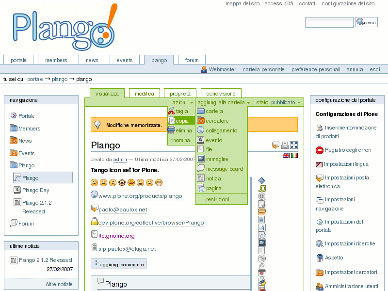

Descrizione
===========

Plango è un prodotto che sostituisce il set di icone standard di Plone con le icone del progetto Tango.

Durante l'installazione, alcuni nuovi livelli vengono aggiunti in tutti gli skin nel portal_skins tool.

I nuovi livelli corrispondono ad alcune cartelle in portal_skins che contengono le icone sostitutive.

Il set di `Icone Tango <http://tango.freedesktop.org/Tango_Icon_Library>`_  è parte del progetto `Tango Desktop <http://tango.freedesktop.org>`_.

Schermata
==========

Installazione
=============

Incolla la cartella del prodotto nella cartella dei prodotti della tua istanza Zope e riavvia il server.

Metodo classico
---------------

Vai sulla pagina 'Configurazione del portale' visibile su Plone e clicca sul collegamento 'Inserimento/rimozione di prodotti'.

Seleziona il prodotto (spunta la casella) e clicca sul pulsante 'Installa'.

Disinstallazione -- Può essere effettuata nella stessa pagina di gestione, ma solo nel caso in cui l'installazione sia avvenuta con il metodo classico.

Metodo con Generic Setup
------------------------

Nella ZMI, vai nella sezione 'portal_setup' e, (1) visualizza la scheda 'Properties' e seleziona 'Plango' nella lista a comparsa prima di cliccare su 'Update'.
Quindi (2) visualizza la scheda 'Import' e clicca su 'Import all steps'.

Mentre aggiungi un 'Plone Site' a Zope (nella ZMI), puoi selezionare 'Plango' nella lista 'Extension Profiles' per averlo installato automaticamente durante la creazione del portale.

Disinstallazione -- Deve essere fatta manualmente nella ZMI, poichè GenericSetup
non possiede (ancora) un API per rimuovere/disinstallare contenuti.

Autore
======

Paolo Melchiorre <paulox@paulox.net>

Ha contribuito
==============

David Convent <davconvent@gmail.com>

Ringraziamenti
==============

Il progetto Tango Desktop per le icone e l'account wiki `PauLoX <http://tango.freedesktop.org/User:PauLoX>`_.

Licenza
=======

Vedi i file `Licenza`_ and `GPL`_.

.. _Licenza: Licenza.it_IT.txt
.. _GPL: GPL.it_IT.txt
