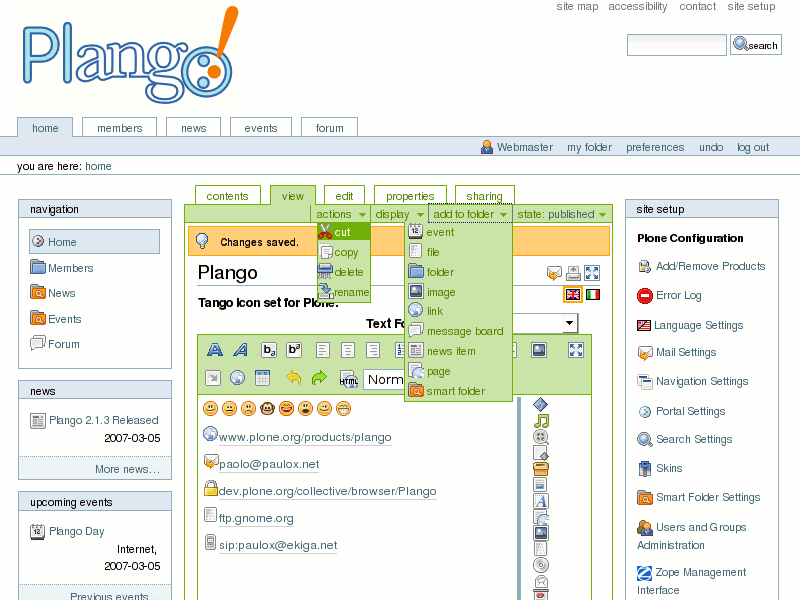

.. image:: plango.gif

Description
===========

Plango is product that replaces the default Plone Icon Set with icons from the Tango Project.

During product installation, some new layers is added to all skins selections in the portal_skins tool.

The new layers corresponds to some folders in portal_skins which contains icon replacements.

The `Tango Icon Set <http://tango.freedesktop.org/Tango_Icon_Library>`_ is part of the `Tango Desktop Project <http://tango.freedesktop.org>`_.

Screenshot
==========

Installation
============

Place the product folder in the Products directory of your Zope instance and restart the server.

The classic way
---------------

Go to the 'Site Setup' page in the Plone interface and click on the 'Add/Remove Products' link.

Choose the product (check its checkbox) and click the 'Install' button.

Uninstall -- This can be done from the same management screen, but only if you installed it from the quick installer.

The Generic Setup way
---------------------

In the ZMI, go to 'portal_setup' and, (1) select the 'Properties' tab and choose 'Plango' in the popup list before clicking 'Update'.
Then (2) go to the 'Import' tab and click 'Import all steps'.

While adding a 'Plone Site' to Zope (from the ZMI), you can select 'Plango' in the proposed 'Extension Profiles' to have it installed automatically during the creation of the portal.

Uninstall -- This must be done manually from the ZMI, as GenericSetup does not have an API for removing/uninstalling stuff (yet).

Author
======

Paolo Melchiorre <paulox@paulox.net>

Contributor
===========

David Convent <davconvent@gmail.com>

Credits
=======

Tango Desktop Project for Icons and `PauLoX wiki account <http://tango.freedesktop.org/User:PauLoX>`_.

License
=======

View `LICENSE`_ and `GPL`_.

.. _LICENSE: LICENSE.txt
.. _GPL: GPL.txt
